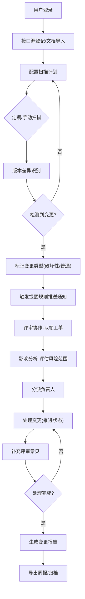

## 1. 产品概述

API 变更雷达是一款面向产品经理、测试工程师和 API 调用方的接口变更追踪与协作平台。通过自动化扫描与人工登记相结合的方式，全链路跟踪 API 接口从发现、识别、评估到处理的完整生命周期，有效降低接口变更带来的业务风险。

- 核心价值：提前感知 API 破坏性变更，精准定位影响范围，驱动跨团队高效协同处理
- 目标用户：产品经理（需求侧）、测试工程师（质量侧）、后端开发（接口提供方）、前端/第三方开发者（接口调用方）

## 2. 核心功能

### 2.1 用户角色

| 角色 | 注册方式 | 核心权限 |
|------|----------|----------|
| 产品经理 | 企业 SSO 登录 | 查看总览、关联需求、分派负责人、导出周报 |
| 测试工程师 | 企业 SSO 登录 | 登记接口源、执行扫描、维护处理状态、补充评审意见 |
| 接口提供方 | 企业 SSO 登录 | 查看影响分析、处理变更、提交评审、维护负责人 |
| 接口调用方 | 企业 SSO 登录 | 订阅提醒、查看影响系统、查看变更详情 |
| 管理员 | 后台分配 | 配置提醒规则、管理用户权限、导入说明文档 |

### 2.2 功能模块

1. **总览页面**：变更趋势仪表盘、待处理任务、告警分布、关键指标卡
2. **接口源页面**：接口集合登记、文档导入、扫描任务配置、版本管理
3. **版本对比页面**：双版本 Diff 视图、路径/参数/字段/状态码/鉴权/示例逐项对比、破坏性变更高亮
4. **影响分析页面**：变更波及系统拓扑、受影响调用方列表、风险评分、负责人映射
5. **提醒规则页面**：订阅通道配置（邮件/钉钉/飞书/短信）、触发条件、静默期管理
6. **评审协作页面**：变更工单流转、评审意见区、处理状态追踪、分派与认领
7. **报告中心页面**：历史趋势图表、变更周报自动生成、多格式导出（PDF/Excel）

### 2.3 页面详情

| 页面名称 | 模块名称 | 功能描述 |
|----------|----------|----------|
| 总览 | 核心指标卡 | 展示总接口数、本月变更数、破坏性变更占比、平均处理时长 |
| 总览 | 变更趋势图 | 近 30 天变更数量折线图，区分破坏性与普通变更 |
| 总览 | 待处理列表 | 按优先级排序的待评审/待处理变更工单 |
| 总览 | 告警分布 | 按接口域/系统模块的变更热力分布 |
| 接口源 | 接口集合表格 | 展示已登记的接口集合、来源、最近扫描时间、版本号 |
| 接口源 | 新建接口源弹窗 | 填写名称、所属系统、接口基地址、鉴权方式、负责人 |
| 接口源 | 文档导入 | 支持 OpenAPI/Swagger/Postman/Markdown 格式批量导入 |
| 接口源 | 扫描调度 | 配置 Cron 定期扫描或手动触发版本扫描 |
| 版本对比 | 版本选择器 | 选择对比的基准版本与目标版本 |
| 版本对比 | Diff 详情区 | 树形结构展示接口路径、请求参数、响应字段、状态码、鉴权、示例的变更差异 |
| 版本对比 | 变更标签 | 标注新增/删除/修改/破坏性四种变更类型，破坏性红色高亮 |
| 版本对比 | 变更统计 | 分类统计各类变更数量与破坏性占比 |
| 影响分析 | 系统拓扑图 | 展示变更接口与上下游系统的调用关系图谱 |
| 影响分析 | 受影响列表 | 列出受影响系统、调用方、负责人、影响程度 |
| 影响分析 | 风险评估 | 基于调用量、SLA 等级、破坏性程度计算风险评分 |
| 影响分析 | 通知建议 | 根据影响范围推荐需要通知的干系人 |
| 提醒规则 | 规则列表 | 展示已配置的提醒规则、触发条件、通知通道、启用状态 |
| 提醒规则 | 新建规则弹窗 | 选择变更类型/严重级别/接口域等触发条件 |
| 提醒规则 | 通道配置 | 邮件/钉钉群机器人/飞书 Webhook/短信模板配置 |
| 提醒规则 | 静默期设置 | 设置夜间/节假日静默与合并通知策略 |
| 评审协作 | 工单看板 | 按处理状态分栏：待评审→处理中→待验证→已关闭 |
| 评审协作 | 工单详情 | 变更内容摘要、关联需求、评论区、操作日志 |
| 评审协作 | 分派与认领 | 指定负责人或自主认领工单 |
| 评审协作 | 状态流转 | 支持状态变更与回退，记录操作人与时间 |
| 报告中心 | 趋势分析 | 按周/月/季度的变更趋势柱线图 |
| 报告中心 | 周报模板 | 自动生成包含变更概览、重点变更、风险项、处理进展的周报 |
| 报告中心 | 导出功能 | 支持 PDF/Excel/Word 格式导出，支持定时推送 |
| 报告中心 | 自定义报表 | 按时间/系统/变更类型多维度筛选统计 |

## 3. 核心流程

用户登录系统后，首先通过接口源页面登记或导入 API 集合；系统按配置的扫描计划定期检测版本变化，识别新增/删除/修改项并自动标记破坏性变更；变更事件触发提醒规则，向相关干系人推送通知；负责人在评审协作页面认领工单、补充评审意见并推进状态流转；产品经理通过影响分析页面评估风险波及范围，分派处理任务；处理完成后系统生成变更周报，支持一键导出分享。

## 4. 用户界面设计

### 4.1 设计风格

- 主色与辅色：深蓝科技感主调（#165DFF 作为主色），搭配橙红警示色（#F53F3F 标记破坏性变更）、翡翠绿（#00B42A 标记已处理）、琥珀金（#FF7D00 标记处理中）
- 按钮风格：圆角 6px，主按钮纯色填充+悬停微浮起效果，次要按钮描边风格，危险按钮红色系
- 字体与字号：标题使用 "Sora" 无衬线字体，正文使用 "Noto Sans SC"；H1 28px/H2 22px/H3 18px/正文 14px/辅助 12px
- 布局风格：左侧固定侧边栏（240px）导航 + 顶部面包屑 + 内容区卡片式布局，使用玻璃拟态（Glassmorphism）卡片效果
- 图标风格：统一使用线性风格图标（Lucide React），破坏性变更配警告三角标，已处理配勾选圆圈

### 4.2 页面设计概览

| 页面名称 | 模块名称 | UI 元素 |
|----------|----------|---------|
| 总览 | 指标卡区域 | 渐变背景卡片、图标+数字组合、同比环比小箭头指示、悬浮微动画 |
| 总览 | 趋势图区域 | 双色折线叠加、渐变填充区、X 轴日期/Y 轴数量、图例悬浮 |
| 总览 | 待处理列表 | 优先级标签色块、状态徽章、鼠标悬浮展开预览、渐入动画 |
| 接口源 | 顶部操作栏 | 搜索框+筛选标签+新建按钮+导入按钮，操作按钮组带图标 |
| 接口源 | 数据表格 | 斑马纹行、状态 Badge、行悬浮显示操作按钮组（扫描/编辑/删除） |
| 版本对比 | 版本选择 | 双列下拉选择器+切换按钮，选择后触发 Diff 渐显动画 |
| 版本对比 | Diff 视图 | 三栏布局（变更类型导航+左旧+右新），新增行绿底+删除行红底+修改行橙底，行号指示 |
| 影响分析 | 拓扑图 | 节点辐射状布局，变更接口节点脉冲动画，连线粗细代表调用量，点击节点高亮关联路径 |
| 评审协作 | 看板 | 四列拖拽看板，卡片带阴影+渐变头部，拖入目标栏高亮提示 |
| 报告中心 | 图表区 | 柱线混合图、渐变柱体、悬浮数据 Tooltip、时间范围快捷筛选 Chip |

### 4.3 响应式设计

- 桌面端优先（≥1280px）：左侧导航全展开，内容区双列/三列栅格
- 平板端（768px-1279px）：左侧导航折叠为图标栏，表格横向滚动
- 移动端（<768px）：顶部汉堡菜单抽屉，卡片单列堆叠，图表简化为单指标展示
- 触摸优化：可点击元素最小高度 44px，滑动手势支持看板卡片拖拽

### 4.4 动效与交互细节

- 页面加载：路由切换时内容区淡入上移（opacity 0→1, translateY 12px→0, 300ms ease-out）
- 卡片悬浮：translateY(-2px) + box-shadow 加深，150ms 过渡
- 破坏性变更闪烁：首次加载时红色光晕脉冲 2 次（box-shadow 0 0 0 0 rgba(245,63,63,0.4) → 0 0 16px 4px）
- 拓扑节点：变更节点持续呼吸效果（scale 1→1.05→1），连线流动虚线动画
- 状态流转：工单卡片从源栏滑出飞入目标栏（translate + rotate 5deg）
