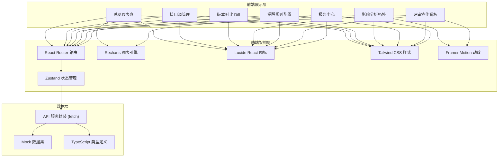
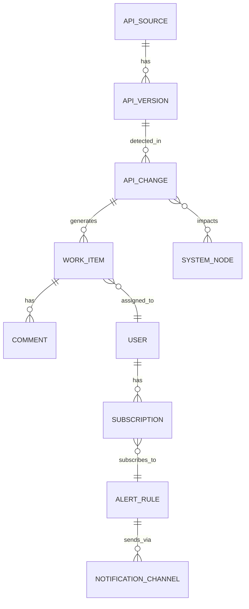

## 1. 架构设计



## 2. 技术选型描述

- 前端框架：React 18.3 + TypeScript 5.4
- 构建工具：Vite 5.2（极速冷启动与 HMR）
- 样式方案：Tailwind CSS 3.4 + PostCSS + Autoprefixer
- 路由管理：React Router Dom 6.23（声明式路由 + 嵌套布局）
- 状态管理：Zustand 4.5（轻量、无 Provider 包裹、支持 Immer middleware）
- 图表渲染：Recharts 2.12（基于 SVG，React 原生，支持自定义 Tooltip）
- 动效库：Framer Motion 11.2（页面切换、节点呼吸、看板拖拽动效）
- 图标库：Lucide React 0.395（线性风格，支持 strokeWidth 配置）
- 工具库：Day.js 1.11（日期格式化）、Classnames 2.5（条件类名拼接）
- 后端服务：无（使用 Mock 数据模拟，所有 API 调用返回静态数据）
- 数据库：无（前端内存存储 + LocalStorage 持久化用户偏好）

## 3. 路由定义

| 路由路径 | 页面名称 | 说明 |
|----------|----------|------|
| /dashboard | 总览仪表盘 | 系统落地页，展示核心指标、趋势、待办 |
| /sources | 接口源管理 | 接口集合登记、文档导入、扫描调度 |
| /diff | 版本对比 | 双版本 Diff 分析与变更识别 |
| /impact | 影响分析 | 系统拓扑、受影响列表、风险评分 |
| /alerts | 提醒规则 | 规则管理、通道配置、静默期 |
| /review | 评审协作 | 工单看板、状态流转、评论协作 |
| /reports | 报告中心 | 趋势报表、周报生成、导出 |
| * | 404 兜底页 | 路由未匹配时显示 |

## 4. 数据模型定义

### 4.1 实体关系图



### 4.2 TypeScript 类型定义

```typescript
// 接口源
interface ApiSource {
  id: string;
  name: string;
  system: string;
  baseUrl: string;
  authType: 'none' | 'bearer' | 'apikey' | 'oauth2';
  owner: string;
  status: 'active' | 'paused' | 'error';
  lastScanAt: string;
  currentVersion: string;
  apiCount: number;
  createdAt: string;
  scanSchedule: string; // Cron expression
}

// API 版本
interface ApiVersion {
  id: string;
  sourceId: string;
  version: string;
  specFormat: 'openapi3' | 'swagger2' | 'postman' | 'markdown';
  endpoints: Endpoint[];
  createdAt: string;
}

// 接口端点
interface Endpoint {
  path: string;
  method: 'GET' | 'POST' | 'PUT' | 'DELETE' | 'PATCH';
  summary: string;
  parameters: Parameter[];
  requestBody?: FieldSchema;
  responses: ResponseSchema[];
  auth: string[];
  examples: Example[];
}

interface Parameter {
  name: string;
  in: 'path' | 'query' | 'header' | 'cookie';
  required: boolean;
  type: string;
  description?: string;
}

interface FieldSchema {
  type: string;
  properties?: Record<string, FieldProperty>;
  required?: string[];
}

interface FieldProperty {
  type: string;
  description?: string;
  example?: any;
  enum?: any[];
}

interface ResponseSchema {
  statusCode: number;
  description: string;
  schema?: FieldSchema;
}

interface Example {
  name: string;
  request?: any;
  response?: any;
}

// 变更记录
type ChangeType = 'added' | 'removed' | 'modified';
type ChangeSeverity = 'breaking' | 'normal' | 'minor';
type ChangeCategory =
  | 'path'
  | 'parameter'
  | 'field'
  | 'statusCode'
  | 'auth'
  | 'example';

interface ApiChange {
  id: string;
  versionFrom: string;
  versionTo: string;
  endpoint: string;
  method: string;
  category: ChangeCategory;
  type: ChangeType;
  severity: ChangeSeverity;
  fieldPath?: string;
  oldValue?: string;
  newValue?: string;
  description: string;
  detectedAt: string;
}

// 工单
type WorkStatus = 'pending_review' | 'in_progress' | 'awaiting_verify' | 'closed';
type WorkPriority = 'critical' | 'high' | 'medium' | 'low';

interface WorkItem {
  id: string;
  title: string;
  changeIds: string[];
  status: WorkStatus;
  priority: WorkPriority;
  assignee?: string;
  reporter: string;
  description: string;
  relatedRequirement?: string;
  createdAt: string;
  updatedAt: string;
  dueDate?: string;
}

// 评论
interface Comment {
  id: string;
  workItemId: string;
  author: string;
  content: string;
  createdAt: string;
  attachments?: string[];
}

// 系统节点（拓扑）
interface SystemNode {
  id: string;
  name: string;
  type: 'api' | 'service' | 'consumer' | 'database' | 'gateway';
  owner: string;
  slaLevel?: 'P0' | 'P1' | 'P2' | 'P3';
  dailyQps?: number;
}

interface SystemEdge {
  source: string;
  target: string;
  callVolume: number; // 日均调用量
  sync: boolean;
}

// 提醒规则
interface AlertRule {
  id: string;
  name: string;
  enabled: boolean;
  triggers: {
    severities: ChangeSeverity[];
    categories: ChangeCategory[];
    sources?: string[];
  };
  channels: NotificationChannel[];
  quietHours?: {
    start: string; // '22:00'
    end: string;   // '08:00'
    mergeDigests: boolean;
  };
  createdAt: string;
  createdBy: string;
}

interface NotificationChannel {
  type: 'email' | 'dingtalk' | 'feishu' | 'sms';
  config: Record<string, string>; // e.g. { webhookUrl, secret, recipients }
}

// 用户
interface User {
  id: string;
  name: string;
  email: string;
  role: 'product' | 'tester' | 'provider' | 'consumer' | 'admin';
  avatar?: string;
}
```

## 5. 目录结构

```
src/
├── assets/            # 静态资源（图标、字体引入）
├── components/        # 通用组件
│   ├── Layout/        # 布局：Sidebar、Header、PageContainer
│   ├── UI/            # 基础 UI：Button、Badge、Card、Modal、Table、Tabs
│   ├── Charts/        # 图表封装：LineChart、BarChart、Heatmap
│   └── Diff/          # Diff 专用组件
├── pages/             # 7 个页面 + 404
│   ├── Dashboard/
│   ├── Sources/
│   ├── Diff/
│   ├── Impact/
│   ├── Alerts/
│   ├── Review/
│   ├── Reports/
│   └── NotFound/
├── store/             # Zustand stores
│   ├── sourceStore.ts
│   ├── changeStore.ts
│   ├── workItemStore.ts
│   ├── alertStore.ts
│   └── userStore.ts
├── mock/              # Mock 数据
│   ├── sources.ts
│   ├── changes.ts
│   ├── workItems.ts
│   ├── topology.ts
│   ├── alerts.ts
│   ├── reports.ts
│   └── users.ts
├── types/             # 类型定义（index.ts 导出所有类型）
├── utils/             # 工具函数（date、format、diff 算法模拟）
├── hooks/             # 自定义 hooks（useDebounce、useDragDrop 等）
├── App.tsx            # 路由配置
├── main.tsx           # 入口
└── index.css          # 全局样式 + Tailwind + 自定义 CSS 变量
```
